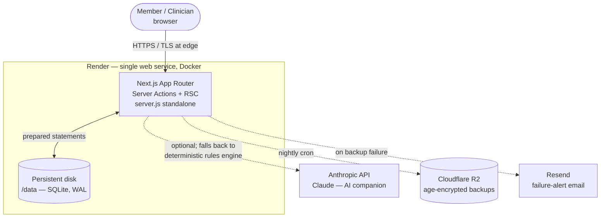
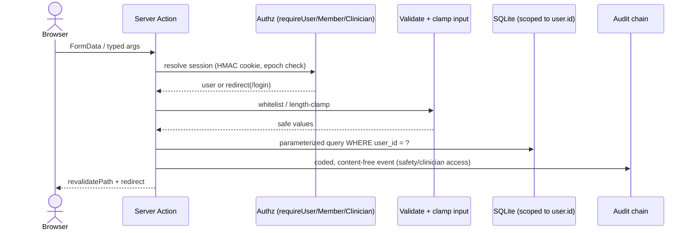
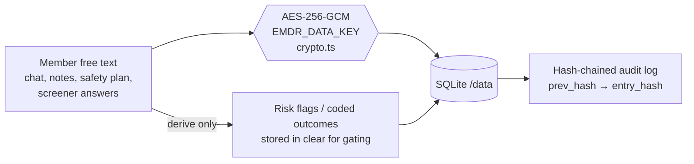
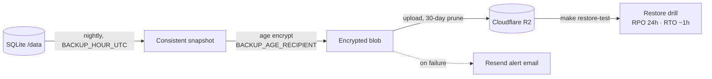

# Architecture

Companion to the prose in the README and the decision records in
[`docs/adr/`](adr/). Diagrams render on GitHub (mermaid).

## System context

Dashed edges are optional integrations: without them the app still runs
(companion degrades to the built-in rules engine; backups/alerts stay off,
logged at boot). See ADR&nbsp;0004 for why this is a single instance.

## Request / trust flow

## Data at rest

A database dump alone never exposes member-entered content (compliance 2.4);
only coded risk flags needed for gating are stored in the clear. The audit log
is append-only and tamper-evident — `verifyAuditChain()` recomputes the chain.

## Backup & disaster recovery

See [`docs/backups.md`](backups.md) and
[`docs/disaster-recovery.md`](disaster-recovery.md). The age **secret** key is
never present on the server — only the public recipient key is.

## Why single-instance

The in-memory rate limiter and the single-writer audit-chain assumption
(`audit.ts`) are only correct with one writer. Horizontal scaling therefore
requires Postgres + a shared rate-limit store first; this is a deliberate,
documented ceiling (ADR&nbsp;0004), acceptable for the current launch scale and
revisited in the load-test plan.
